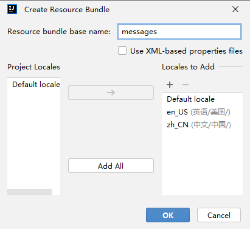

### springboot集成i18国际化

resource 

新建 i18n目录，new  Resource bundle  ->  名字为 messages

新建资源文件

```
en_US
zh_CN
```




文件中输入

sms.code.retry.limit.exceed="验证码超过限制"


application-i18n.yml 配置 

```yml
--- # 国际化配置
spring:
  messages:
    # 国际化资源文件路径
    basename: i18n/messages
```


#### hugo-framework

top.hugo.common.utils

```java
package top.hugo.framework.utils;

import cn.hutool.extra.spring.SpringUtil;
import lombok.AccessLevel;
import lombok.NoArgsConstructor;
import org.springframework.context.MessageSource;
import org.springframework.context.i18n.LocaleContextHolder;

/**
 * 获取i18n资源文件
 *
 * @author kuanghua
 */
@NoArgsConstructor(access = AccessLevel.PRIVATE)
public class MessageUtils {

    private static final MessageSource MESSAGE_SOURCE = SpringUtil.getBean(MessageSource.class);
    /**
     * 根据消息键和参数 获取消息 委托给spring messageSource
     *
     * @param code 消息键
     * @param args 参数
     * @return 获取国际化翻译值
     */
    public static String message(String code, Object... args) {
        return MESSAGE_SOURCE.getMessage(code, args, LocaleContextHolder.getLocale());
    }
}
```

测试案例

```java
package top.hugo.demo.controller;


import org.springframework.web.bind.annotation.GetMapping;
import org.springframework.web.bind.annotation.RestController;
import top.hugo.framework.utils.MessageUtils;

/**
 * i18n测试
 */
@RestController
public class TestI18NController {
    /**
     * test接口
     */
    @GetMapping("i18n")
    public String test() {
        return MessageUtils.message("sms.code.retry.limit.exceed", 1, 2);
    }
}
```


idea中文件编码问题
 edit-> file-encoding -> utf-8