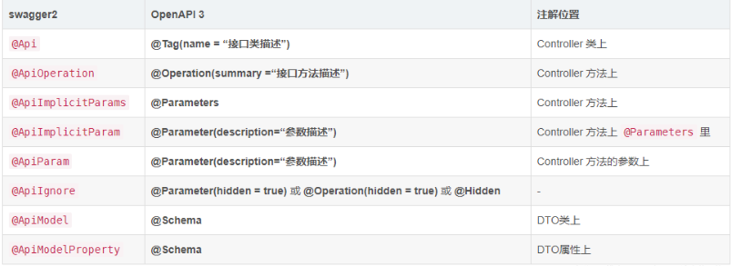

## springboot集成swagger3及knife4j

swagger和knife4j的pom依赖

```xml
<!--swagger文档-->
<dependency>
    <groupId>org.springdoc</groupId>
    <artifactId>springdoc-openapi-webmvc-core</artifactId>
    <version>1.6.14</version>
</dependency>
<dependency>
    <groupId>org.springdoc</groupId>
    <artifactId>springdoc-openapi-javadoc</artifactId>
    <version>1.6.14</version>
</dependency>
<dependency>
    <groupId>com.github.xiaoymin</groupId>
    <artifactId>knife4j-openapi3-spring-boot-starter</artifactId>
    <version>4.1.0</version>
</dependency>
```

配置文件

application-doc.yml

```yml
# Swagger配置
swagger:
  # 是否开启swagger
  enabled: true
  info:
    # 标题
    title: '标题：${spring.application.name}后台管理系统_接口文档'
    # 描述
    description: '描述：用于管理集团旗下公司的人员信息,具体包括XXX,XXX模块,6的不行'
    # 版本
    version: '版本号: ${micro-service-single.version}'
    # 作者信息
    contact:
      name: hugo
      email: xxx@163.com
      url: https://gitee.com/xxxx/
  components:
    # 鉴权方式配置
    security-schemes:
      apiKey:
        type: APIKEY
        in: HEADER
        name: ""

springdoc:
  swagger-ui:
    # 持久化认证数据
    persistAuthorization: true
  #这里定义了两个分组，可定义多个，也可以不定义
  group-configs:
    - group: common
      packages-to-scan: top.hugo

knife4j:
  enable: true
  openapi:
    title: xxx官方文档(swagger3.0文档)
    description: "xxx官方文档"
    email: xxxx@163.com
    concat: 熊猫哥
    url: https://github.jzfai.top/micro-service-api/doc.html
    version: v4.0
```


#### 获取swagger配置属性

```java
package top.hugo.framework.config.properties;

import io.swagger.v3.oas.models.Components;
import io.swagger.v3.oas.models.ExternalDocumentation;
import io.swagger.v3.oas.models.Paths;
import io.swagger.v3.oas.models.info.Contact;
import io.swagger.v3.oas.models.info.License;
import io.swagger.v3.oas.models.tags.Tag;
import lombok.Data;
import org.springframework.boot.context.properties.ConfigurationProperties;
import org.springframework.boot.context.properties.NestedConfigurationProperty;
import org.springframework.stereotype.Component;

import java.util.List;

/**
 * swagger 配置属性
 *
 * @author kuanghua
 */
@Data
@Component
@ConfigurationProperties(prefix = "swagger")
public class SwaggerProperties {

    /**
     * 是否开启 openApi 文档
     */
    private Boolean enabled = true;

    /**
     * 文档基本信息
     */
    @NestedConfigurationProperty
    private InfoProperties info = new InfoProperties();

    /**
     * 扩展文档地址
     */
    @NestedConfigurationProperty
    private ExternalDocumentation externalDocs;

    /**
     * 标签
     */
    private List<Tag> tags = null;

    /**
     * 路径
     */
    @NestedConfigurationProperty
    private Paths paths = null;

    /**
     * 组件
     */
    @NestedConfigurationProperty
    private Components components = null;

    /**
     * <p>
     * 文档的基础属性信息
     * </p>
     *
     * @see io.swagger.v3.oas.models.info.Info
     * <p>
     * 为了 springboot 自动生产配置提示信息，所以这里复制一个类出来
     */
    @Data
    public static class InfoProperties {

        /**
         * 标题
         */
        private String title = null;

        /**
         * 描述
         */
        private String description = null;

        /**
         * 联系人信息
         */
        @NestedConfigurationProperty
        private Contact contact = null;

        /**
         * 许可证
         */
        @NestedConfigurationProperty
        private License license = null;

        /**
         * 版本
         */
        private String version = null;

    }
}
```


配置swagger

```java
package top.hugo.framework.config;

import cn.hutool.core.util.ObjectUtil;
import io.swagger.v3.oas.models.OpenAPI;
import io.swagger.v3.oas.models.Paths;
import io.swagger.v3.oas.models.info.Info;
import io.swagger.v3.oas.models.security.SecurityRequirement;
import lombok.RequiredArgsConstructor;
import org.springdoc.core.*;
import org.springdoc.core.customizers.OpenApiBuilderCustomizer;
import org.springdoc.core.customizers.OpenApiCustomiser;
import org.springdoc.core.customizers.ServerBaseUrlCustomizer;
import org.springdoc.core.providers.JavadocProvider;
import org.springframework.boot.autoconfigure.AutoConfigureBefore;
import org.springframework.boot.autoconfigure.condition.ConditionalOnMissingBean;
import org.springframework.boot.autoconfigure.condition.ConditionalOnProperty;
import org.springframework.boot.autoconfigure.web.ServerProperties;
import org.springframework.context.annotation.Bean;
import org.springframework.context.annotation.Configuration;

import java.util.ArrayList;
import java.util.List;
import java.util.Optional;
import java.util.Set;

/**
 * Swagger 文档配置
 *
 * @author kuanghua
 */
@RequiredArgsConstructor
@Configuration
@AutoConfigureBefore(SpringDocConfiguration.class)
@ConditionalOnProperty(name = "swagger.enabled", havingValue = "true", matchIfMissing = true)
public class SwaggerConfig {

    private final SwaggerProperties swaggerProperties;
    private final ServerProperties serverProperties;

    @Bean
    @ConditionalOnMissingBean(OpenAPI.class)
    public OpenAPI openApi() {
        OpenAPI openApi = new OpenAPI();
        // 文档基本信息
        SwaggerProperties.InfoProperties infoProperties = swaggerProperties.getInfo();
        Info info = convertInfo(infoProperties);
        openApi.info(info);
        // 扩展文档信息
        openApi.externalDocs(swaggerProperties.getExternalDocs());
        openApi.tags(swaggerProperties.getTags());
        openApi.paths(swaggerProperties.getPaths());
        openApi.components(swaggerProperties.getComponents());
        Set<String> keySet = swaggerProperties.getComponents().getSecuritySchemes().keySet();
        List<SecurityRequirement> list = new ArrayList<>();
        SecurityRequirement securityRequirement = new SecurityRequirement();
        keySet.forEach(securityRequirement::addList);
        list.add(securityRequirement);
        openApi.security(list);

        return openApi;
    }

    private Info convertInfo(SwaggerProperties.InfoProperties infoProperties) {
        Info info = new Info();
        info.setTitle(infoProperties.getTitle());
        info.setDescription(infoProperties.getDescription());
        info.setContact(infoProperties.getContact());
        info.setLicense(infoProperties.getLicense());
        info.setVersion(infoProperties.getVersion());
        return info;
    }

    /**
     * 自定义 openapi 处理器
     */
    @Bean
    public OpenAPIService openApiBuilder(Optional<OpenAPI> openAPI,
                                         SecurityService securityParser,
                                         SpringDocConfigProperties springDocConfigProperties, PropertyResolverUtils propertyResolverUtils,
                                         Optional<List<OpenApiBuilderCustomizer>> openApiBuilderCustomisers,
                                         Optional<List<ServerBaseUrlCustomizer>> serverBaseUrlCustomisers, Optional<JavadocProvider> javadocProvider) {
        return new OpenApiHandler(openAPI, securityParser, springDocConfigProperties, propertyResolverUtils, openApiBuilderCustomisers, serverBaseUrlCustomisers, javadocProvider);
    }
    /**
     * 对已经生成好的 OpenApi 进行自定义操作
     */
    @Bean
    public OpenApiCustomiser openApiCustomiser() {
        String contextPath = serverProperties.getServlet().getContextPath();
        String finalContextPath;
        if (ObjectUtil.isEmpty(contextPath) || "/".equals(contextPath)) {
            finalContextPath = "";
        } else {
            finalContextPath = contextPath;
        }
        // 对所有路径增加前置上下文路径
        return openApi -> {
            Paths oldPaths = openApi.getPaths();
            if (oldPaths instanceof PlusPaths) {
                return;
            }
            PlusPaths newPaths = new PlusPaths();
            oldPaths.forEach((k, v) -> newPaths.addPathItem(finalContextPath + k, v));
            openApi.setPaths(newPaths);
        };
    }
    /**
     * 单独使用一个类便于判断 解决springdoc路径拼接重复问题
     *
     * @author kuanghua
     */
    static class PlusPaths extends Paths {
        public PlusPaths() {
            super();
        }
    }
}
```


自定义 openapi 处理器 (自动读取注释生成文档，移除了大量的swagger注解)

```java
package top.hugo.framework.handler;

import cn.hutool.core.io.IoUtil;
import io.swagger.v3.core.jackson.TypeNameResolver;
import io.swagger.v3.core.util.AnnotationsUtils;
import io.swagger.v3.oas.annotations.tags.Tags;
import io.swagger.v3.oas.models.Components;
import io.swagger.v3.oas.models.OpenAPI;
import io.swagger.v3.oas.models.Operation;
import io.swagger.v3.oas.models.Paths;
import io.swagger.v3.oas.models.tags.Tag;
import org.apache.commons.lang3.StringUtils;
import org.slf4j.Logger;
import org.slf4j.LoggerFactory;
import org.springdoc.core.OpenAPIService;
import org.springdoc.core.PropertyResolverUtils;
import org.springdoc.core.SecurityService;
import org.springdoc.core.SpringDocConfigProperties;
import org.springdoc.core.customizers.OpenApiBuilderCustomizer;
import org.springdoc.core.customizers.ServerBaseUrlCustomizer;
import org.springdoc.core.providers.JavadocProvider;
import org.springframework.context.ApplicationContext;
import org.springframework.core.annotation.AnnotatedElementUtils;
import org.springframework.util.CollectionUtils;
import org.springframework.web.method.HandlerMethod;

import java.io.StringReader;
import java.lang.reflect.Method;
import java.util.*;
import java.util.stream.Collectors;
import java.util.stream.Stream;

/**
 * 自定义 openapi 处理器
 * 对源码功能进行修改 增强使用
 */
@SuppressWarnings("all")
public class OpenApiHandler extends OpenAPIService {

    /**
     * The constant LOGGER.
     */
    private static final Logger LOGGER = LoggerFactory.getLogger(OpenAPIService.class);
    /**
     * The Basic error controller.
     */
    private static Class<?> basicErrorController;

    static {
        try {
            //spring-boot 2
            basicErrorController = Class.forName("org.springframework.boot.autoconfigure.web.servlet.error.BasicErrorController");
        } catch (ClassNotFoundException e) {
            //spring-boot 1
            try {
                basicErrorController = Class.forName("org.springframework.boot.autoconfigure.web.BasicErrorController");
            } catch (ClassNotFoundException classNotFoundException) {
                //Basic error controller class not found
                LOGGER.trace(classNotFoundException.getMessage());
            }
        }
    }
    /**
     * The Security parser.
     */
    private final SecurityService securityParser;
    /**
     * The Mappings map.
     */
    private final Map<String, Object> mappingsMap = new HashMap<>();
    /**
     * The Springdoc tags.
     */
    private final Map<HandlerMethod, io.swagger.v3.oas.models.tags.Tag> springdocTags = new HashMap<>();
    /**
     * The Open api builder customisers.
     */
    private final Optional<List<OpenApiBuilderCustomizer>> openApiBuilderCustomisers;
    /**
     * The server base URL customisers.
     */
    private final Optional<List<ServerBaseUrlCustomizer>> serverBaseUrlCustomizers;
    /**
     * The Spring doc config properties.
     */
    private final SpringDocConfigProperties springDocConfigProperties;
    /**
     * The Cached open api map.
     */
    private final Map<String, OpenAPI> cachedOpenAPI = new HashMap<>();
    /**
     * The Property resolver utils.
     */
    private final PropertyResolverUtils propertyResolverUtils;
    /**
     * The javadoc provider.
     */
    private final Optional<JavadocProvider> javadocProvider;
    /**
     * The Context.
     */
    private ApplicationContext context;
    /**
     * The Open api.
     */
    private OpenAPI openAPI;
    /**
     * The Is servers present.
     */
    private boolean isServersPresent;
    /**
     * The Server base url.
     */
    private String serverBaseUrl;

    /**
     * Instantiates a new Open api builder.
     *
     * @param openAPI                   the open api
     * @param securityParser            the security parser
     * @param springDocConfigProperties the spring doc config properties
     * @param propertyResolverUtils     the property resolver utils
     * @param openApiBuilderCustomizers the open api builder customisers
     * @param serverBaseUrlCustomizers  the server base url customizers
     * @param javadocProvider           the javadoc provider
     */
    public OpenApiHandler(Optional<OpenAPI> openAPI, SecurityService securityParser,
                          SpringDocConfigProperties springDocConfigProperties, PropertyResolverUtils propertyResolverUtils,
                          Optional<List<OpenApiBuilderCustomizer>> openApiBuilderCustomizers,
                          Optional<List<ServerBaseUrlCustomizer>> serverBaseUrlCustomizers,
                          Optional<JavadocProvider> javadocProvider) {
        super(openAPI, securityParser, springDocConfigProperties, propertyResolverUtils, openApiBuilderCustomizers, serverBaseUrlCustomizers, javadocProvider);
        if (openAPI.isPresent()) {
            this.openAPI = openAPI.get();
            if (this.openAPI.getComponents() == null)
                this.openAPI.setComponents(new Components());
            if (this.openAPI.getPaths() == null)
                this.openAPI.setPaths(new Paths());
            if (!CollectionUtils.isEmpty(this.openAPI.getServers()))
                this.isServersPresent = true;
        }
        this.propertyResolverUtils = propertyResolverUtils;
        this.securityParser = securityParser;
        this.springDocConfigProperties = springDocConfigProperties;
        this.openApiBuilderCustomisers = openApiBuilderCustomizers;
        this.serverBaseUrlCustomizers = serverBaseUrlCustomizers;
        this.javadocProvider = javadocProvider;
        if (springDocConfigProperties.isUseFqn())
            TypeNameResolver.std.setUseFqn(true);
    }
    
    @Override
    public Operation buildTags(HandlerMethod handlerMethod, Operation operation, OpenAPI openAPI, Locale locale) {

        Set<Tag> tags = new HashSet<>();
        Set<String> tagsStr = new HashSet<>();

        buildTagsFromMethod(handlerMethod.getMethod(), tags, tagsStr, locale);
        buildTagsFromClass(handlerMethod.getBeanType(), tags, tagsStr, locale);

        if (!CollectionUtils.isEmpty(tagsStr))
            tagsStr = tagsStr.stream()
                    .map(str -> propertyResolverUtils.resolve(str, locale))
                    .collect(Collectors.toSet());

        if (springdocTags.containsKey(handlerMethod)) {
            io.swagger.v3.oas.models.tags.Tag tag = springdocTags.get(handlerMethod);
            tagsStr.add(tag.getName());
            if (openAPI.getTags() == null || !openAPI.getTags().contains(tag)) {
                openAPI.addTagsItem(tag);
            }
        }
        if (!CollectionUtils.isEmpty(tagsStr)) {
            if (CollectionUtils.isEmpty(operation.getTags()))
                operation.setTags(new ArrayList<>(tagsStr));
            else {
                Set<String> operationTagsSet = new HashSet<>(operation.getTags());
                operationTagsSet.addAll(tagsStr);
                operation.getTags().clear();
                operation.getTags().addAll(operationTagsSet);
            }
        }

        if (isAutoTagClasses(operation)) {
            if (javadocProvider.isPresent()) {
                String description = javadocProvider.get().getClassJavadoc(handlerMethod.getBeanType());
                if (StringUtils.isNotBlank(description)) {
                    io.swagger.v3.oas.models.tags.Tag tag = new io.swagger.v3.oas.models.tags.Tag();

                    // 自定义部分 修改使用java注释当tag名
                    List<String> list = IoUtil.readLines(new StringReader(description), new ArrayList<>());
                    // tag.setName(tagAutoName);
                    tag.setName(list.get(0));
                    operation.addTagsItem(list.get(0));

                    tag.setDescription(description);
                    if (openAPI.getTags() == null || !openAPI.getTags().contains(tag)) {
                        openAPI.addTagsItem(tag);
                    }
                }
            } else {
                String tagAutoName = splitCamelCase(handlerMethod.getBeanType().getSimpleName());
                operation.addTagsItem(tagAutoName);
            }
        }

        if (!CollectionUtils.isEmpty(tags)) {
            // Existing tags
            List<io.swagger.v3.oas.models.tags.Tag> openApiTags = openAPI.getTags();
            if (!CollectionUtils.isEmpty(openApiTags))
                tags.addAll(openApiTags);
            openAPI.setTags(new ArrayList<>(tags));
        }

        // Handle SecurityRequirement at operation level
        io.swagger.v3.oas.annotations.security.SecurityRequirement[] securityRequirements = securityParser
                .getSecurityRequirements(handlerMethod);
        if (securityRequirements != null) {
            if (securityRequirements.length == 0)
                operation.setSecurity(Collections.emptyList());
            else
                securityParser.buildSecurityRequirement(securityRequirements, operation);
        }

        return operation;
    }

    private void buildTagsFromMethod(Method method, Set<io.swagger.v3.oas.models.tags.Tag> tags, Set<String> tagsStr, Locale locale) {
        // method tags
        Set<Tags> tagsSet = AnnotatedElementUtils
                .findAllMergedAnnotations(method, Tags.class);
        Set<io.swagger.v3.oas.annotations.tags.Tag> methodTags = tagsSet.stream()
                .flatMap(x -> Stream.of(x.value())).collect(Collectors.toSet());
        methodTags.addAll(AnnotatedElementUtils.findAllMergedAnnotations(method, io.swagger.v3.oas.annotations.tags.Tag.class));
        if (!CollectionUtils.isEmpty(methodTags)) {
            tagsStr.addAll(methodTags.stream().map(tag -> propertyResolverUtils.resolve(tag.name(), locale)).collect(Collectors.toSet()));
            List<io.swagger.v3.oas.annotations.tags.Tag> allTags = new ArrayList<>(methodTags);
            addTags(allTags, tags, locale);
        }
    }

    private void addTags(List<io.swagger.v3.oas.annotations.tags.Tag> sourceTags, Set<io.swagger.v3.oas.models.tags.Tag> tags, Locale locale) {
        Optional<Set<io.swagger.v3.oas.models.tags.Tag>> optionalTagSet = AnnotationsUtils
                .getTags(sourceTags.toArray(new io.swagger.v3.oas.annotations.tags.Tag[0]), true);
        optionalTagSet.ifPresent(tagsSet -> {
            tagsSet.forEach(tag -> {
                tag.name(propertyResolverUtils.resolve(tag.getName(), locale));
                tag.description(propertyResolverUtils.resolve(tag.getDescription(), locale));
                if (tags.stream().noneMatch(t -> t.getName().equals(tag.getName())))
                    tags.add(tag);
            });
        });
    }
}
```


文档测试案例

top.hugo.admin.controller.TestDocController

```java
package top.hugo.admin.controller;

import org.springframework.web.bind.annotation.GetMapping;
import org.springframework.web.bind.annotation.RestController;

/**
 *  文档测试
 */
@RestController
public class TestDocController {
    /**
     * test接口
     * @param name 名字
     * @param age 年龄
     */
    @GetMapping("test")
    public String test(String name,String age) {
        return name + age;
    }
}
```

swagger2和swagger3注解对比


