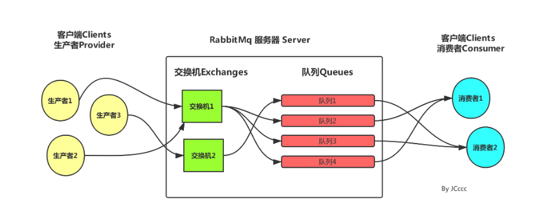

## docker-compose 安装rabbitMq

上传文件夹  [rabbitmq](https://gitee.com/jzfai/micro-serivce-learn/tree/master/docs-file/rabbitmq)   到   /docker目录下

开放目录权限

```shell
chmod -R  777 /docker/rabbitmq
```

设置 rabbitmq配置文件

```yml
cat >/docker/compose/rabbitmq.yml<<EOF
version: '3'
services:
  rabbitmq:
    image: rabbitmq:3.10.6
    container_name: rabbitmq
    build:
      context: /docker/rabbitmq
    environment:
      RABBITMQ_DEFAULT_USER: admin
      RABBITMQ_DEFAULT_PASS: admin
    ports:
      - "15672:15672" # 管理界面端口
      - "5672:5672"   # api 端口
    volumes:
      - /docker/rabbitmq/log:/var/log/rabbitmq
      - /docker/rabbitmq/data:/var/lib/rabbitmq
    network_mode: "host"
EOF
```

部署

```shell
docker-compose -f /docker/compose/rabbitmq.yml  up -d rabbitmq
```

开放：15672，5672 端口


打开控制台：http://xxx:15672


## springboot集成rabbitmq

相关文章：
https://blog.csdn.net/qq_35387940/article/details/100514134




主要 分为  生产者->交换机-> routingkey  ->队列 -> 消费者


### maven

```xml
<!--rabbitmq-->
<dependency>
    <groupId>org.springframework.boot</groupId>
    <artifactId>spring-boot-starter-amqp</artifactId>
</dependency>
```

### yml

```yml
---  #配置rabbitMq 服务器
spring:
  rabbitmq:
    host: xxx
    port: 5672
    username: admin
    password: admin
    #虚拟host 可以不设置,使用server默认host
    #virtual-host: JCcccHost
```

>xxx -> 您部署的 ip


### 直联模式（direct）

DirectRabbit

```java
package top.hugo.admin.config;

import org.springframework.amqp.core.Binding;
import org.springframework.amqp.core.BindingBuilder;
import org.springframework.amqp.core.DirectExchange;
import org.springframework.amqp.core.Queue;
import org.springframework.context.annotation.Bean;
import org.springframework.context.annotation.Configuration;
 
/**
 * @Author : JCccc
 * @CreateTime : 2019/9/3
 * @Description :
 **/
@Configuration
public class DirectRabbit {
 
    //队列 起名：TestDirectQueue
    @Bean
    public Queue TestDirectQueue() {
        // durable:是否持久化,默认是false,持久化队列：会被存储在磁盘上，当消息代理重启时仍然存在，暂存队列：当前连接有效
        // exclusive:默认也是false，只能被当前创建的连接使用，而且当连接关闭后队列即被删除。此参考优先级高于durable
        // autoDelete:是否自动删除，当没有生产者或者消费者使用此队列，该队列会自动删除。
        // return new Queue("TestDirectQueue",true,true,false);
 
        //一般设置一下队列的持久化就好,其余两个就是默认false
        return new Queue("TestDirectQueue",true);
    }
 
    //Direct交换机 起名：TestDirectExchange
    @Bean
    DirectExchange TestDirectExchange() {
      //  return new DirectExchange("TestDirectExchange",true,true);
        return new DirectExchange("TestDirectExchange",true,false);
    }
 
    //绑定  将队列和交换机绑定, 并设置用于匹配键：TestDirectRouting
    @Bean
    Binding bindingDirect() {
        return BindingBuilder.bind(TestDirectQueue()).to(TestDirectExchange()).with("TestDirectRouting");
    }
}
```

productor

```java
package top.hugo.admin.controller;

import org.springframework.amqp.rabbit.core.RabbitTemplate;
import org.springframework.beans.factory.annotation.Autowired;
import org.springframework.web.bind.annotation.GetMapping;
import org.springframework.web.bind.annotation.RestController;

import java.time.LocalDateTime;
import java.time.format.DateTimeFormatter;
import java.util.HashMap;
import java.util.Map;
import java.util.UUID;
 
/**
 * @Author : 熊猫哥
 * @Description :
 **/
@RestController
public class SendRabbitController {
    @Autowired
    private RabbitTemplate rabbitTemplate;  //使用RabbitTemplate,这提供了接收/发送等等方法
    @GetMapping("/sendDirectMessage")
    public String sendDirectMessage() {
        String messageId = String.valueOf(UUID.randomUUID());
        String messageData = "test message, hello!";
        String createTime = LocalDateTime.now().format(DateTimeFormatter.ofPattern("yyyy-MM-dd HH:mm:ss"));
        Map<String,Object> map=new HashMap<>();
        map.put("messageId",messageId);
        map.put("messageData",messageData);
        map.put("createTime",createTime);
        //将消息携带绑定键值：TestDirectRouting 发送到交换机TestDirectExchange
        for (int i = 0; i < 100; i++) {
            map.put("messageData",messageData+i);
            rabbitTemplate.convertAndSend("TestDirectExchange", "TestDirectRouting", map);
        }
        return "ok";
    }
}
```

consumer

DirectReceiver

```java
package top.hugo.admin.listener;

import org.springframework.amqp.rabbit.annotation.RabbitHandler;
import org.springframework.amqp.rabbit.annotation.RabbitListener;
import org.springframework.stereotype.Component;
import java.util.Map;

@Component
@RabbitListener(queues = "TestDirectQueue")//监听的队列名称 TestDirectQueue
public class DirectConsumer {
    @RabbitHandler
    public void process(Map testMessage) {
        System.out.println("DirectReceiver消费者收到消息  : " + testMessage.toString());
    }
}
```


## topic模式

TopicRabbit

```java
package top.hugo.admin.config;

import org.springframework.amqp.core.Binding;
import org.springframework.amqp.core.BindingBuilder;
import org.springframework.amqp.core.Queue;
import org.springframework.amqp.core.TopicExchange;
import org.springframework.context.annotation.Bean;
import org.springframework.context.annotation.Configuration;
 
/**
 * @Author : JCccc
 * @CreateTime : 2019/9/3
 * @Description :
 **/
 
@Configuration
public class TopicRabbit {
    //绑定键
    public final static String man = "topic.man";
    public final static String woman = "topic.woman";
 
    @Bean
    public Queue firstQueue() {
        return new Queue(TopicRabbitConfig.man);
    }
 
    @Bean
    public Queue secondQueue() {
        return new Queue(TopicRabbitConfig.woman);
    }
 
    @Bean
    TopicExchange exchange() {
        return new TopicExchange("topicExchange");
    }
 
 
    //将firstQueue和topicExchange绑定,而且绑定的键值为topic.man
    //这样只要是消息携带的路由键是topic.man,才会分发到该队列
    @Bean
    Binding bindingExchangeMessage() {
        return BindingBuilder.bind(firstQueue()).to(exchange()).with(man);
    }
 
    //将secondQueue和topicExchange绑定,而且绑定的键值为用上通配路由键规则topic.#
    // 这样只要是消息携带的路由键是以topic.开头,都会分发到该队列
    @Bean
    Binding bindingExchangeMessage2() {
        return BindingBuilder.bind(secondQueue()).to(exchange()).with("topic.#");
    }
}
```

生产者

SendMessageController

```java
package top.hugo.admin.controller;

import org.springframework.amqp.rabbit.core.RabbitTemplate;
import org.springframework.beans.factory.annotation.Autowired;
import org.springframework.web.bind.annotation.GetMapping;
import org.springframework.web.bind.annotation.RestController;

import java.time.LocalDateTime;
import java.time.format.DateTimeFormatter;
import java.util.HashMap;
import java.util.Map;
import java.util.UUID;
 
/**
 * @Author : JCccc
 * @CreateTime : 2019/9/3
 * @Description :
 **/
@RestController
public class SendMessageController {
 
    @Autowired
    private RabbitTemplate rabbitTemplate;  //使用RabbitTemplate,这提供了接收/发送等等方法
    /**
     * topic 模式
     * @return
     */
    @GetMapping("/sendTopicMessage1")
    public String sendTopicMessage1() {
        String messageId = String.valueOf(UUID.randomUUID());
        String messageData = "message: M A N ";
        String createTime = LocalDateTime.now().format(DateTimeFormatter.ofPattern("yyyy-MM-dd HH:mm:ss"));
        Map<String, Object> manMap = new HashMap<>();
        manMap.put("messageId", messageId);
        manMap.put("messageData", messageData);
        manMap.put("createTime", createTime);
        //将消息携带绑定键值：TestDirectRouting 发送到交换机TestDirectExchange
        for (int i = 0; i < 100; i++) {
            manMap.put("messageData",messageData+i);
            rabbitTemplate.convertAndSend("topicExchange", "topic.woman", manMap);
        }
        return "ok";
    }
    @GetMapping("/sendTopicMessage2")
    public String sendTopicMessage2() {
        String messageId = String.valueOf(UUID.randomUUID());
        String messageData = "message: woman is all ";
        String createTime = LocalDateTime.now().format(DateTimeFormatter.ofPattern("yyyy-MM-dd HH:mm:ss"));
        Map<String, Object> womanMap = new HashMap<>();
        womanMap.put("messageId", messageId);
        womanMap.put("messageData", messageData);
        womanMap.put("createTime", createTime);
        //将消息携带绑定键值：TestDirectRouting 发送到交换机TestDirectExchange
        for (int i = 0; i < 100; i++) {
            womanMap.put("messageData",messageData+i);
            rabbitTemplate.convertAndSend("topicExchange", "topic.woman", womanMap);
        }
        return "ok";
    }
}
```

消费者

TopicManConsumer

```java
package top.hugo.admin.listener;

import org.springframework.amqp.rabbit.annotation.RabbitHandler;
import org.springframework.amqp.rabbit.annotation.RabbitListener;
import org.springframework.stereotype.Component;
import java.util.Map;
 
/**
 * @Author : JCccc
 * @CreateTime : 2019/9/3
 * @Description :
 **/
@Component
@RabbitListener(queues = "topic.man")
public class TopicManConsumer {
 
    @RabbitHandler
    public void process(Map testMessage) {
        System.out.println("TopicManReceiver消费者收到消息  : " + testMessage.toString());
    }
}
```

TopicTotalConsumer

```java
package top.hugo.admin.listener;
 
import org.springframework.amqp.rabbit.annotation.RabbitHandler;
import org.springframework.amqp.rabbit.annotation.RabbitListener;
import org.springframework.stereotype.Component;
import java.util.Map;
 
/**
 * @Author : 熊猫哥
 * @CreateTime : 2023-07-23
 * @Description :
 **/
@Component
@RabbitListener(queues = "topic.woman")
public class TopicTotalConsumer {
    @RabbitHandler
    public void process(Map testMessage) {
        System.out.println("TopicTotalReceiver消费者收到消息  : " + testMessage.toString());
    }
}
```

运行服务，打开swagger文档，进行测试